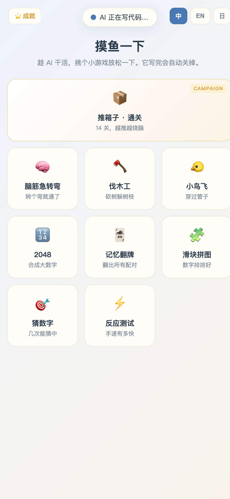
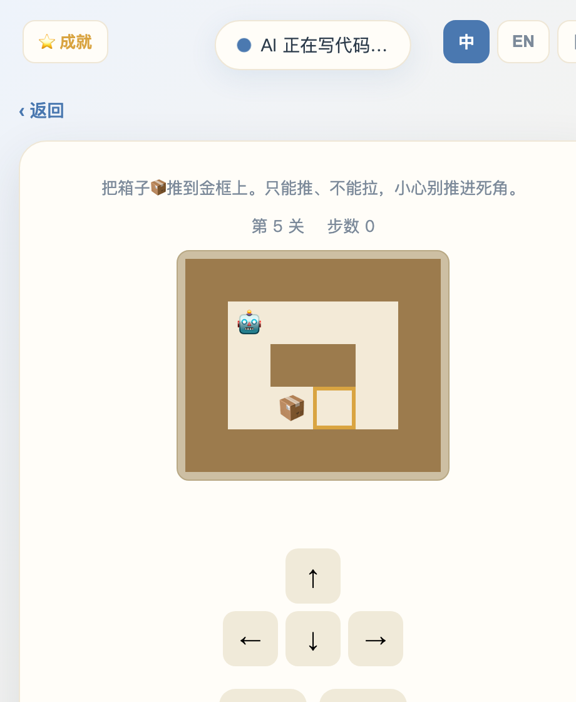
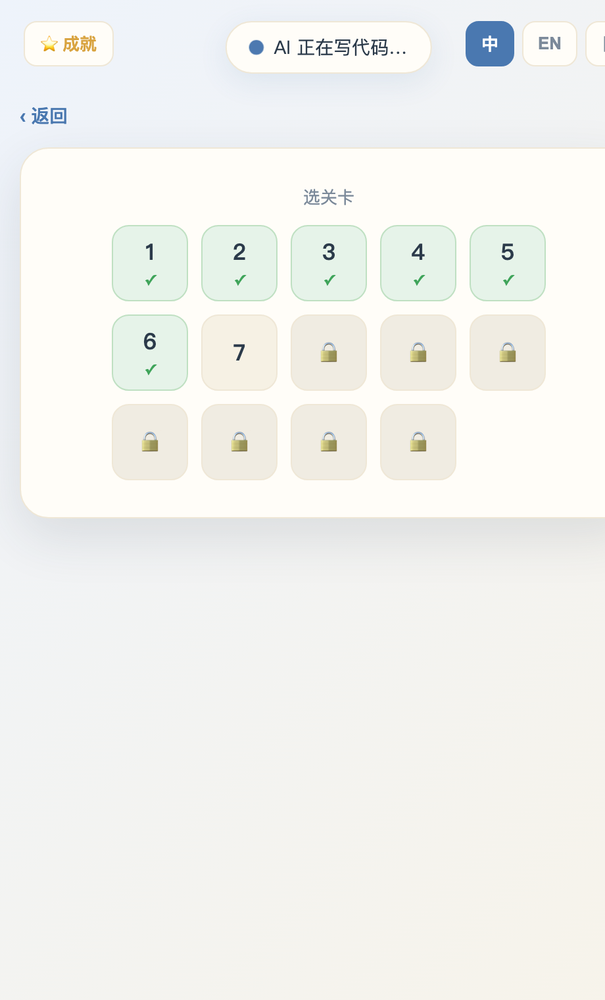
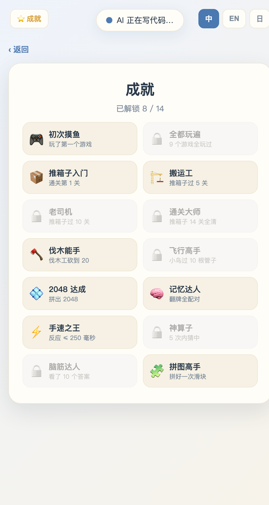

<div align="center">

# ☕ Coffee Break

### Play mini-games while Claude Code thinks.

**The arcade opens itself when a task runs long — and closes itself the moment the AI is done.**

[English](README.md) · [简体中文](README.zh-CN.md) · [日本語](README.ja.md)

[](LICENSE)




</div>

---

## Why?

Watching an AI agent write code is mostly… waiting. Coffee Break turns that dead
time into a quick game. It runs as a **Claude Code skill + hooks**, so you never
have to think about it:

| When | What happens |
| --- | --- |
| You send a prompt and the task runs **longer than ~10s** | A clean game window pops up |
| The task is short (< 10s) | Nothing — you're not interrupted |
| Claude **finishes** the task | The window shows *"AI is done!"* and **closes itself** |

It's one self-contained HTML file. **No build, no dependencies, no network, no tracking.**

## What's inside — 9 games

<table>
<tr>
<td width="50%" valign="top">

**📦 Sokoban · Campaign**
A full **14-level** push-the-box campaign with level select, progress saving,
move counter, and undo. Every level was **verified solvable by a BFS solver**
before shipping — no broken puzzles.

</td>
<td width="50%" valign="top">



</td>
</tr>
</table>

…plus eight more for when you just want to zone out:

| | Game | |  | Game | |
|---|---|---|---|---|---|
| 🧠 | **Riddles** | lateral-thinking brain teasers | 🃏 | **Memory** | match the pairs |
| 🪓 | **Timberman** | chop & dodge the branches | 🧩 | **Slide Puzzle** | order the tiles |
| 🐤 | **Flappy** | fly through the gaps | 🎯 | **Guess** | hi-lo number hunt |
| 🔢 | **2048** | merge the tiles | ⚡ | **Reaction** | test your reflexes |

## 🏆 Achievements & 🌐 3 languages

<table>
<tr>
<td width="48%" valign="top"></td>
<td width="52%" valign="top"></td>
</tr>
</table>

- **16 achievements** unlock as you play, with a pop-up toast and a progress board.
- Full UI in **English / 简体中文 / 日本語**, switchable any time (top-right). Riddles
  use a hand-written bank per language — not machine translations.
- Progress and unlocks are saved locally in your browser.

## Install

```bash
git clone https://github.com/Langzishueth/claude-coffee-break.git
cd claude-coffee-break
./install.sh
```

Then **restart Claude Code** (or approve the new hooks via `/hooks`). That's it —
the arcade now opens automatically on long tasks.

> **Requirements:** `python3` (built-in on macOS) for the local server, and
> Google Chrome / Chromium for the self-closing window. Without Chrome it falls
> back to your default browser (you just close the tab yourself).

## Use it manually

Don't want full-auto? Skip `install.sh` and just open the arcade whenever:

```bash
./launch.sh now      # opens the arcade immediately
./done.sh            # signals "done" so the window closes
```

Or open `index.html` directly in any browser.

## Configure

| Want to… | Do this |
| --- | --- |
| Change the "long task" threshold | edit `COFFEE_DELAY` (seconds) in `launch.sh` |
| Change the local port | set `COFFEE_PORT` (default `8765`) |
| Turn off full-auto | `./uninstall.sh` then restart Claude Code |

## How it works

Two tiny shell scripts are wired into Claude Code's hooks:

- **`launch.sh`** → `UserPromptSubmit` hook. Marks the task running, serves the
  game on `localhost`, waits `COFFEE_DELAY` seconds, and opens the window **only
  if the task is still going** (so short tasks never interrupt you).
- **`done.sh`** → `Stop` hook. Marks the task done. The page polls this and
  closes its own window after a short countdown.

```
you prompt ─▶ UserPromptSubmit ─▶ launch.sh ─▶ (wait 10s, still busy?) ─▶ 🎮 window opens
AI finishes ─▶ Stop ─▶ done.sh ─▶ page sees "done" ─▶ window closes itself
```

## License

[MIT](LICENSE) — do whatever you like. PRs for new games, levels, and languages
are very welcome.

<div align="center">
<sub>Built for the long compiles. ☕</sub>
</div>
